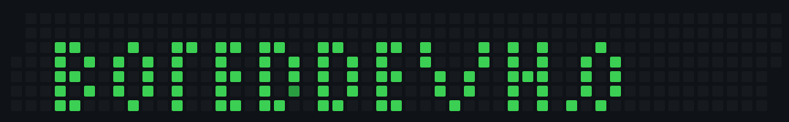

  

<h1 align="left">Hey 👋 Welcome to the BoredCafe.</h1>

###

My name is Chris and I'm a high school student from the Netherlands. I specialize in front-end and making beautiful user experiences.  Want to know more? Check my <a href="https://boreddev.nl">Portfolio.</a>

###

<h2 align="left">About me</h2>

###

📚 I'm currently learning game development in Gamemaker Studio. 🎯 Goals: Mastering game design and development.

###

<h2 align="left">Active project(s):</h2>
<ul>
  <li>💾 <a href="https://github.com/boreddevhq/brewkernel">Brew Kernel.</a></li>
  <li>👾 <a href="https://github.com/boreddevhq/zeroday">ZeroDay.</a></li>
</ul>

###

<h2 align="left">Most used languages:</h2>

###

  
  
  
  
  
  
  
  
  
  
  
  
  
  
  
  
  

###
###

  
  

<h2 align="left">Support Me 💜</h2>

###

  If you enjoy my work and want to support what I do, consider buying me a coffee!
    
  

###
